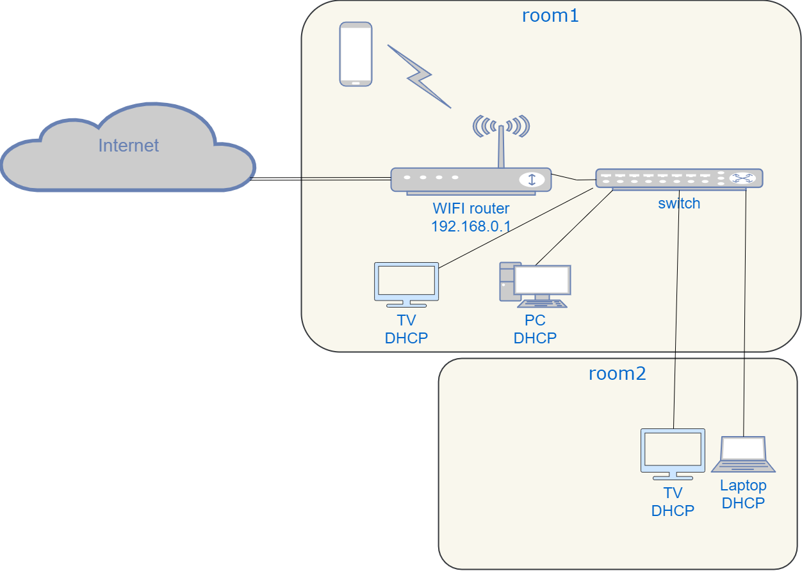

# Домашнее задание к занятию "3.8. Компьютерные сети, лекция 3"

1. Подключитесь к публичному маршрутизатору в интернет. Найдите маршрут к вашему публичному IP
```
telnet route-views.routeviews.org
Username: rviews
show ip route x.x.x.x/32
show bgp x.x.x.x/32
```
```
route-views>sh ip route 87.119.224.191 0.0.0.0
Routing entry for 87.119.224.0/20
  Known via "bgp 6447", distance 20, metric 0
  Tag 6939, type external
  Last update from 64.71.137.241 1w2d ago
  Routing Descriptor Blocks:
  * 64.71.137.241, from 64.71.137.241, 1w2d ago
      Route metric is 0, traffic share count is 1
      AS Hops 2
      Route tag 6939
      MPLS label: none
route-views>sh bgp  87.119.224.191 0.0.0.0
BGP routing table entry for 87.119.224.0/20, version 1388581247
Paths: (24 available, best #23, table default)
  Not advertised to any peer
  Refresh Epoch 1
  2497 12389
    202.232.0.2 from 202.232.0.2 (58.138.96.254)
      Origin IGP, localpref 100, valid, external
      path 7FE12DD51848 RPKI State valid
      rx pathid: 0, tx pathid: 0
  Refresh Epoch 1
  3267 1299 12389
    194.85.40.15 from 194.85.40.15 (185.141.126.1)
      Origin IGP, metric 0, localpref 100, valid, external
      path 7FE0249EB158 RPKI State valid
      rx pathid: 0, tx pathid: 0
  Refresh Epoch 1
  20912 3257 3356 12389
    212.66.96.126 from 212.66.96.126 (212.66.96.126)
      Origin IGP, localpref 100, valid, external
      Community: 3257:8070 3257:30515 3257:50001 3257:53900 3257:53902 20912:65004
      path 7FE17A6DA5A8 RPKI State valid
      rx pathid: 0, tx pathid: 0
  Refresh Epoch 1
  4901 6079 3356 12389
    162.250.137.254 from 162.250.137.254 (162.250.137.254)
      Origin IGP, localpref 100, valid, external
      Community: 65000:10100 65000:10300 65000:10400
      path 7FE012118650 RPKI State valid
      rx pathid: 0, tx pathid: 0
  Refresh Epoch 3
  3303 12389
    217.192.89.50 from 217.192.89.50 (138.187.128.158)
      Origin IGP, localpref 100, valid, external
      Community: 3303:1004 3303:1006 3303:1030 3303:3056
      path 7FE16DD2EF68 RPKI State valid
      rx pathid: 0, tx pathid: 0
  Refresh Epoch 1
  7660 2516 12389
    203.181.248.168 from 203.181.248.168 (203.181.248.168)
      Origin IGP, localpref 100, valid, external
      Community: 2516:1050 7660:9001
      path 7FE0176BB8B8 RPKI State valid
      rx pathid: 0, tx pathid: 0
  Refresh Epoch 1
  57866 3356 12389
    37.139.139.17 from 37.139.139.17 (37.139.139.17)
      Origin IGP, metric 0, localpref 100, valid, external
      Community: 3356:2 3356:22 3356:100 3356:123 3356:501 3356:901 3356:2065
      path 7FE141B822C0 RPKI State valid
      rx pathid: 0, tx pathid: 0
  Refresh Epoch 1
  7018 3356 12389
    12.0.1.63 from 12.0.1.63 (12.0.1.63)
      Origin IGP, localpref 100, valid, external
      Community: 7018:5000 7018:37232
      path 7FE1101605F8 RPKI State valid
      rx pathid: 0, tx pathid: 0
  Refresh Epoch 1
  3333 1103 12389
    193.0.0.56 from 193.0.0.56 (193.0.0.56)
      Origin IGP, localpref 100, valid, external
      path 7FE117631188 RPKI State valid
      rx pathid: 0, tx pathid: 0
  Refresh Epoch 1
  49788 12552 12389
    91.218.184.60 from 91.218.184.60 (91.218.184.60)
      Origin IGP, localpref 100, valid, external
      Community: 12552:12000 12552:12100 12552:12101 12552:22000
      Extended Community: 0x43:100:1
      path 7FE11CB6D978 RPKI State valid
      rx pathid: 0, tx pathid: 0
  Refresh Epoch 1
  8283 1299 12389
    94.142.247.3 from 94.142.247.3 (94.142.247.3)
      Origin IGP, metric 0, localpref 100, valid, external
      Community: 1299:30000 8283:1 8283:101 8283:103
      unknown transitive attribute: flag 0xE0 type 0x20 length 0x24
        value 0000 205B 0000 0000 0000 0001 0000 205B
              0000 0005 0000 0001 0000 205B 0000 0005
              0000 0003
      path 7FE034E33190 RPKI State valid
      rx pathid: 0, tx pathid: 0
  Refresh Epoch 1
  3356 12389
    4.68.4.46 from 4.68.4.46 (4.69.184.201)
      Origin IGP, metric 0, localpref 100, valid, external
      Community: 3356:2 3356:22 3356:100 3356:123 3356:501 3356:901 3356:2065
      path 7FE100259128 RPKI State valid
      rx pathid: 0, tx pathid: 0
  Refresh Epoch 1
  1221 4637 12389
    203.62.252.83 from 203.62.252.83 (203.62.252.83)
      Origin IGP, localpref 100, valid, external
      path 7FE0DFAE2D18 RPKI State valid
      rx pathid: 0, tx pathid: 0
  Refresh Epoch 1
  852 3356 12389
    154.11.12.212 from 154.11.12.212 (96.1.209.43)
      Origin IGP, metric 0, localpref 100, valid, external
      path 7FE0B933FB28 RPKI State valid
      rx pathid: 0, tx pathid: 0
  Refresh Epoch 1
  20130 6939 12389
    140.192.8.16 from 140.192.8.16 (140.192.8.16)
      Origin IGP, localpref 100, valid, external
      path 7FE032452AD8 RPKI State valid
      rx pathid: 0, tx pathid: 0
  Refresh Epoch 1
  701 1273 12389
    137.39.3.55 from 137.39.3.55 (137.39.3.55)
      Origin IGP, localpref 100, valid, external
      path 7FE0295AF130 RPKI State valid
      rx pathid: 0, tx pathid: 0
  Refresh Epoch 1
  3257 1299 12389
    89.149.178.10 from 89.149.178.10 (213.200.83.26)
      Origin IGP, metric 10, localpref 100, valid, external
      Community: 3257:8794 3257:30052 3257:50001 3257:54900 3257:54901
      path 7FE154F5B6C8 RPKI State valid
      rx pathid: 0, tx pathid: 0
  Refresh Epoch 1
  3549 3356 12389
    208.51.134.254 from 208.51.134.254 (67.16.168.191)
      Origin IGP, metric 0, localpref 100, valid, external
      Community: 3356:2 3356:22 3356:100 3356:123 3356:501 3356:901 3356:2065 3549:2581 3549:30840
      path 7FE0EF82DC98 RPKI State valid
      rx pathid: 0, tx pathid: 0
  Refresh Epoch 1
  53767 14315 6453 6453 3356 12389
    162.251.163.2 from 162.251.163.2 (162.251.162.3)
      Origin IGP, localpref 100, valid, external
      Community: 14315:5000 53767:5000
      path 7FE0D6F289D8 RPKI State valid
      rx pathid: 0, tx pathid: 0
  Refresh Epoch 1
  101 3356 12389
    209.124.176.223 from 209.124.176.223 (209.124.176.223)
      Origin IGP, localpref 100, valid, external
      Community: 101:20100 101:20110 101:22100 3356:2 3356:22 3356:100 3356:123 3356:501 3356:901 3356:2065
      Extended Community: RT:101:22100
      path 7FE026B47BF8 RPKI State valid
      rx pathid: 0, tx pathid: 0
  Refresh Epoch 1
  3561 3910 3356 12389
    206.24.210.80 from 206.24.210.80 (206.24.210.80)
      Origin IGP, localpref 100, valid, external
      path 7FE0E9EC5420 RPKI State valid
      rx pathid: 0, tx pathid: 0
  Refresh Epoch 1
  1351 6939 12389
    132.198.255.253 from 132.198.255.253 (132.198.255.253)
      Origin IGP, localpref 100, valid, external
      path 7FE160FD03F0 RPKI State valid
      rx pathid: 0, tx pathid: 0
  Refresh Epoch 1
  6939 12389
    64.71.137.241 from 64.71.137.241 (216.218.252.164)
      Origin IGP, localpref 100, valid, external, best
      path 7FE0DED5E8C0 RPKI State valid
      rx pathid: 0, tx pathid: 0x0
  Refresh Epoch 1
  19214 3257 3356 12389
    208.74.64.40 from 208.74.64.40 (208.74.64.40)
      Origin IGP, localpref 100, valid, external
      Community: 3257:8108 3257:30048 3257:50002 3257:51200 3257:51203
      path 7FE12A13D2F8 RPKI State valid
      rx pathid: 0, tx pathid: 0

```


2. Создайте dummy0 интерфейс в Ubuntu. Добавьте несколько статических маршрутов. Проверьте таблицу маршрутизации.
	```
	root@vagrant:~# echo "dummy" >> /etc/modules
	
	root@vagrant:~# echo "options dummy numdummies=2" > /etc/modprobe.d/dummy.conf
	
	cat  /etc/network/interfaces
	# interfaces(5) file used by ifup(8) and ifdown(8)
	# Include files from /etc/network/interfaces.d:
	source-directory /etc/network/interfaces.d
	auto dummy0
	iface dummy0 inet static
    address 10.2.2.2/32
    pre-up ip link add dummy0 type dummy
    post-down ip link del dummy0

	root@vagrant:~# systemctl restart networking

	root@vagrant:~# ip addr
	1: lo: <LOOPBACK,UP,LOWER_UP> mtu 65536 qdisc noqueue state UNKNOWN group default qlen 1000
		link/loopback 00:00:00:00:00:00 brd 00:00:00:00:00:00
		inet 127.0.0.1/8 scope host lo
		   valid_lft forever preferred_lft forever
		inet6 ::1/128 scope host
		   valid_lft forever preferred_lft forever
	2: eth0: <BROADCAST,MULTICAST,UP,LOWER_UP> mtu 1500 qdisc fq_codel state UP group default qlen 1000
		link/ether 08:00:27:73:60:cf brd ff:ff:ff:ff:ff:ff
		inet 10.0.2.15/24 brd 10.0.2.255 scope global dynamic eth0
		   valid_lft 83370sec preferred_lft 83370sec
		inet6 fe80::a00:27ff:fe73:60cf/64 scope link
		   valid_lft forever preferred_lft forever
	3: dummy0: <BROADCAST,NOARP,UP,LOWER_UP> mtu 1500 qdisc noqueue state UNKNOWN group default qlen 1000
		link/ether 92:c5:c5:47:55:7c brd ff:ff:ff:ff:ff:ff
		inet 10.2.2.2/32 brd 10.2.2.2 scope global dummy0
		   valid_lft forever preferred_lft forever
		inet6 fe80::90c5:c5ff:fe47:557c/64 scope link
		   valid_lft forever preferred_lft forever
		   
	root@vagrant:~# ip route add 10.1.1.0/24 via 10.0.2.254	
	root@vagrant:~# ip route add 192.168.50.0/24 via 10.0.2.254
	root@vagrant:~# ip route show
	default via 10.0.2.2 dev eth0 proto dhcp src 10.0.2.15 metric 100
	10.0.2.0/24 dev eth0 proto kernel scope link src 10.0.2.15
	10.0.2.2 dev eth0 proto dhcp scope link src 10.0.2.15 metric 100
	10.1.1.0/24 via 10.0.2.254 dev eth0
	192.168.50.0/24 via 10.0.2.254 dev eth0


	```
	
3. Проверьте открытые TCP порты в Ubuntu, какие протоколы и приложения используют эти порты? Приведите несколько примеров.
	```
	root@vagrant:~# ss -tlnp
	State                 Recv-Q                Send-Q                               Local Address:Port                                Peer Address:Port                Process
	LISTEN                0                     4096                                       0.0.0.0:111                                      0.0.0.0:*                    users:(("rpcbind",pid=558,fd=4),("systemd",pid=1,fd=62))
	LISTEN                0                     4096                                 127.0.0.53%lo:53                                       0.0.0.0:*                    users:(("systemd-resolve",pid=560,fd=13))
	LISTEN                0                     128                                        0.0.0.0:22                                       0.0.0.0:*                    users:(("sshd",pid=770,fd=3))
	LISTEN                0                     4096                                          [::]:111                                         [::]:*                    users:(("rpcbind",pid=558,fd=6),("systemd",pid=1,fd=64))
	LISTEN                0                     128                                           [::]:22                                          [::]:*                    users:(("sshd",pid=770,fd=4))
	```
	*22 порт использует ssh; 53 служба systemd, выполняющая разрешение сетевых имён для локальных приложений; 111  rpcbind-демон, сопоставляющий универсальные адреса и номера программ RPC*
	
4. Проверьте используемые UDP сокеты в Ubuntu, какие протоколы и приложения используют эти порты?
	```
	root@vagrant:~# ss -ulpn
	State                 Recv-Q                Send-Q                                Local Address:Port                               Peer Address:Port                Process
	UNCONN                0                     0                                    10.0.2.15%eth0:68                                      0.0.0.0:*                    users:(("systemd-network",pid=398,fd=15))
	UNCONN                0                     0                                           0.0.0.0:111                                     0.0.0.0:*                    users:(("rpcbind",pid=558,fd=5),("systemd",pid=1,fd=63))
	UNCONN                0                     0                                     127.0.0.53%lo:53                                      0.0.0.0:*                    users:(("systemd-resolve",pid=560,fd=12))
	UNCONN                0                     0                                              [::]:111                                        [::]:*                    users:(("rpcbind",pid=558,fd=7),("systemd",pid=1,fd=65))

	```
	*53 DNS; 111 RPC; 68 systemd-network*
5. Используя diagrams.net, создайте L3 диаграмму вашей домашней сети или любой другой сети, с которой вы работали. 


 
