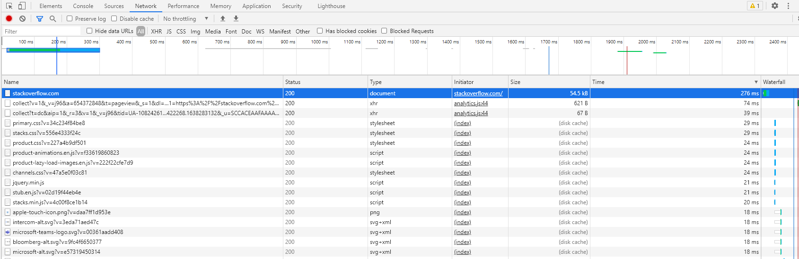

# Домашнее задание к занятию "3.6. Компьютерные сети, лекция 1"

1. Работа c HTTP через телнет.
- Подключитесь утилитой телнет к сайту stackoverflow.com
`telnet stackoverflow.com 80`
- отправьте HTTP запрос
```bash
GET /questions HTTP/1.0
HOST: stackoverflow.com
[press enter]
[press enter]
```
- В ответе укажите полученный HTTP код, что он означает?

	```
	HTTP/1.1 301 Moved Permanently
	cache-control: no-cache, no-store, must-revalidate
	location: https://stackoverflow.com/questions
	x-request-guid: 08ed5d32-be36-4476-8013-b03e1e4683f8
	feature-policy: microphone 'none'; speaker 'none'
	content-security-policy: upgrade-insecure-requests; frame-ancestors 'self' https://stackexchange.com
	Accept-Ranges: bytes
	Date: Tue, 30 Nov 2021 14:44:31 GMT
	Via: 1.1 varnish
	Connection: close
	X-Served-By: cache-fra19133-FRA
	X-Cache: MISS
	X-Cache-Hits: 0
	X-Timer: S1638283472.742875,VS0,VE92
	Vary: Fastly-SSL
	X-DNS-Prefetch-Control: off
	Set-Cookie: prov=07849aa7-84c7-b321-9b4f-5f86b00e0e7c; domain=.stackoverflow.com; expires=Fri, 01-Jan-2055 00:00:00 GMT; path=/; HttpOnly
	Connection closed by foreign host.
	```
	*В ответ пришли заголовки без тела. В стартовой строке HTTP код состояния 301 говорит клиенту о том, что запрашиваемая страница была перенесена на новый адрес, обычно браузер автоматически переходит по новому адресу.*

2. Повторите задание 1 в браузере, используя консоль разработчика F12.
- откройте вкладку `Network`
- отправьте запрос http://stackoverflow.com
- найдите первый ответ HTTP сервера, откройте вкладку `Headers`
- укажите в ответе полученный HTTP код.
	
- проверьте время загрузки страницы, какой запрос обрабатывался дольше всего?
- приложите скриншот консоли браузера в ответ.
	
3. Какой IP адрес у вас в интернете?
	```
	serg@vagrant:~$ curl http://icanhazip.com
	87.119.253.31
	```
4. Какому провайдеру принадлежит ваш IP адрес? Какой автономной системе AS? Воспользуйтесь утилитой `whois`
	
	**Провайдер**
	
	```
	serg@vagrant:~$ whois -h whois.ripe.net 87.119.253.31
	% This is the RIPE Database query service.
	% The objects are in RPSL format.
	%
	% The RIPE Database is subject to Terms and Conditions.
	% See http://www.ripe.net/db/support/db-terms-conditions.pdf

	% Note: this output has been filtered.
	%       To receive output for a database update, use the "-B" flag.

	% Information related to '87.119.240.0 - 87.119.255.255'

	% Abuse contact for '87.119.240.0 - 87.119.255.255' is 'abuse@rt.ru'

	inetnum:        87.119.240.0 - 87.119.255.255
	netname:        RU-SARANSK
	descr:          Branch in Mordovian Republic OJSC "VolgaTelecom"
	country:        RU
	org:            ORG-BiMR1-RIPE
	admin-c:        ASA9-RIPE
	tech-c:         MAA5-RIPE
	status:         ASSIGNED PA
	mnt-by:         MORDOVIA-MNT
	mnt-lower:      MORDOVIA-MNT
	mnt-domains:    MORDOVIA-MNT
	mnt-routes:     MORDOVIA-MNT
	created:        2008-10-22T09:16:42Z
	last-modified:  2008-10-22T09:16:42Z
	source:         RIPE # Filtered

	organisation:   ORG-BiMR1-RIPE
	org-name:       Branch in Mordovian Republic OJSC "VolgaTelecom"
	org-type:       OTHER
	address:        Branch in Mordovian Republic OJSC Ivan Shubin BOL'SHEVISTSKAYA 13 430000 REPUBLIC OF MORDOVIA SARANSK RUSSIAN FEDERATION
	phone:          +7 8342479879
	fax-no:         +7 8342476070
	admin-c:        VT-RU
	tech-c:         VT-RU
	mnt-by:         MORDOVIA-MNT
	mnt-ref:        MORDOVIA-MNT
	created:        2004-12-24T06:11:13Z
	last-modified:  2020-01-15T08:10:39Z
	source:         RIPE # Filtered

	```
	**Автономная система (AS12389)**
	
	```
	serg@vagrant:~$ whois -h whois.radb.net 87.119.253.31
	route:          87.119.240.0/20
	descr:          Rostelecom networks
	origin:         AS12389
	mnt-by:         MNT-VOLGATELECOM
	created:        2018-10-24T07:45:48Z
	last-modified:  2018-10-24T07:45:48Z
	source:         RIPE
	remarks:        ****************************
	remarks:        * THIS OBJECT IS MODIFIED
	remarks:        * Please note that all data that is generally regarded as personal
	remarks:        * data has been removed from this object.
	remarks:        * To view the original object, please query the RIPE Database at:
	remarks:        * http://www.ripe.net/whois

	```
5. Через какие сети проходит пакет, отправленный с вашего компьютера на адрес 8.8.8.8? Через какие AS? Воспользуйтесь утилитой `traceroute`
	```
	serg@vagrant:~$ traceroute -IAn 8.8.8.8
	traceroute to 8.8.8.8 (8.8.8.8), 30 hops max, 60 byte packets
	 1  10.0.2.2 [*]  0.165 ms  0.150 ms  0.128 ms
	 2  192.168.0.1 [*]  1.528 ms  1.699 ms  1.647 ms
	 3  87.119.240.1 [AS12389]  6.932 ms  5.533 ms  5.263 ms
	 4  188.254.26.244 [AS12389]  7.741 ms  7.960 ms  8.638 ms
	 5  87.226.181.89 [AS12389]  15.805 ms  15.796 ms  17.779 ms
	 6  74.125.51.172 [AS15169]  15.477 ms  16.390 ms  15.309 ms
	 7  * * *
	 8  216.239.51.32 [AS15169]  33.801 ms * *
	 9  216.239.48.224 [AS15169]  35.828 ms  36.006 ms  37.433 ms
	10  172.253.51.223 [AS15169]  37.392 ms  37.346 ms  42.301 ms
	11  * * *
	12  * * *
	13  * * *
	14  * * *
	15  * * *
	16  * * *
	17  * * *
	18  * * *
	19  * * *
	20  8.8.8.8 [AS15169]  35.461 ms  33.962 ms  33.869 ms
	```
6. Повторите задание 5 в утилите `mtr`. На каком участке наибольшая задержка - delay?
	```
	vagrant (10.0.2.15)                                                                                                                                                                                                 2021-11-30T16:55:21+0000
	Keys:  Help   Display mode   Restart statistics   Order of fields   quit
																																																		Packets               Pings
	 Host                                                                                                                                                                                             Loss%   Snt   Last   Avg  Best  Wrst StDev
	 1. AS???    10.0.2.2                                                                                                                                                                              0.0%     9    0.7   0.9   0.3   1.8   0.4
	 2. AS???    192.168.0.1                                                                                                                                                                           0.0%     9    2.4   2.8   2.2   3.7   0.6
	 3. AS12389  87.119.240.1                                                                                                                                                                          0.0%     9    4.8   5.7   3.9  13.5   3.2
	 4. AS12389  188.254.26.244                                                                                                                                                                        0.0%     9    5.9   4.1   2.9   5.9   1.0
	 5. AS12389  87.226.181.89                                                                                                                                                                         0.0%     9   15.6  15.5  14.6  17.7   1.0
	 6. AS15169  74.125.51.172                                                                                                                                                                         0.0%     9   21.9  16.1  13.9  21.9   2.4
	 7. AS15169  108.170.250.113                                                                                                                                                                      62.5%     9   17.2  17.5  16.7  18.7   1.0
	 8. AS15169  142.251.49.158                                                                                                                                                                       87.5%     9   48.7  48.7  48.7  48.7   0.0
	 9. AS15169  74.125.253.94                                                                                                                                                                        66.7%     9   29.9  30.6  29.9  31.6   0.9
	10. AS15169  142.250.210.45                                                                                                                                                                        0.0%     9   31.4  31.9  30.2  33.9   1.2
	11. (waiting for reply)
	12. (waiting for reply)
	13. (waiting for reply)
	14. (waiting for reply)
	15. (waiting for reply)
	16. (waiting for reply)
	17. (waiting for reply)
	18. AS15169  8.8.8.8                                                                                                                                                                              71.4%     8   32.2  32.4  32.2  32.6   0.3
	```
	*На восьмом прыжке наибольшая задержка*
	
7. Какие DNS сервера отвечают за доменное имя dns.google? Какие A записи? воспользуйтесь утилитой `dig`
	```
	serg@vagrant:~$ dig +trace  @8.8.8.8 dns.google
	```
	**сервера**
	```
	dns.google.             10800   IN      NS      ns3.zdns.google.
	dns.google.             10800   IN      NS      ns1.zdns.google.
	dns.google.             10800   IN      NS      ns4.zdns.google.
	dns.google.             10800   IN      NS      ns2.zdns.google.
	```
	**A записи**
	```
	dns.google.             900     IN      A       8.8.8.8
    dns.google.             900     IN      A       8.8.4.4
	```
	
8. Проверьте PTR записи для IP адресов из задания 7. Какое доменное имя привязано к IP? воспользуйтесь утилитой `dig`

	```
	serg@vagrant:~$ dig -x 8.8.4.4

	; <<>> DiG 9.16.1-Ubuntu <<>> -x 8.8.4.4
	;; global options: +cmd
	;; Got answer:
	;; ->>HEADER<<- opcode: QUERY, status: NOERROR, id: 5726
	;; flags: qr rd ra; QUERY: 1, ANSWER: 1, AUTHORITY: 0, ADDITIONAL: 1

	;; OPT PSEUDOSECTION:
	; EDNS: version: 0, flags:; udp: 65494
	;; QUESTION SECTION:
	;4.4.8.8.in-addr.arpa.          IN      PTR

	;; ANSWER SECTION:
	4.4.8.8.in-addr.arpa.   3275    IN      PTR     dns.google.

	;; Query time: 0 msec
	;; SERVER: 127.0.0.53#53(127.0.0.53)
	;; WHEN: Tue Nov 30 18:15:41 UTC 2021
	;; MSG SIZE  rcvd: 73

	```
	
	*Доменное имя dns.google.*
	


