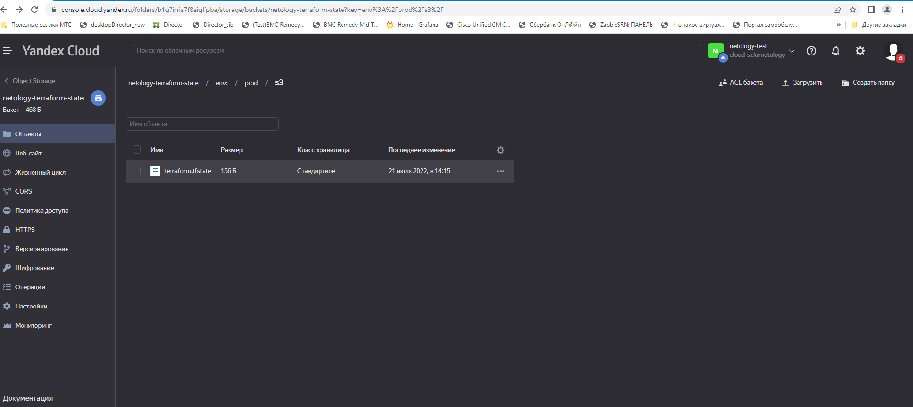
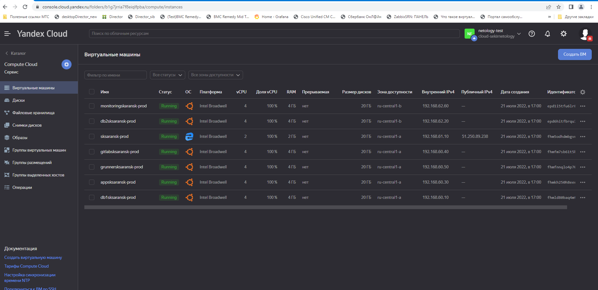
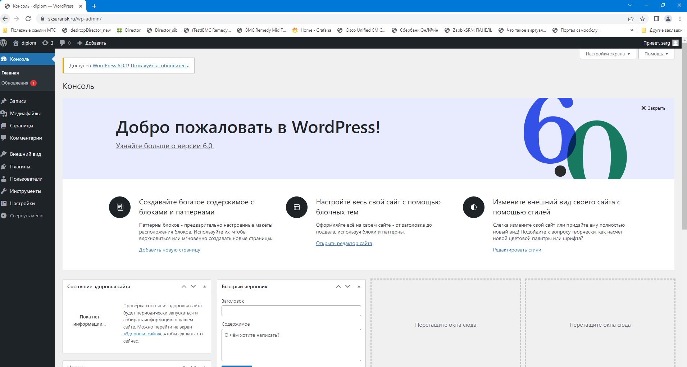
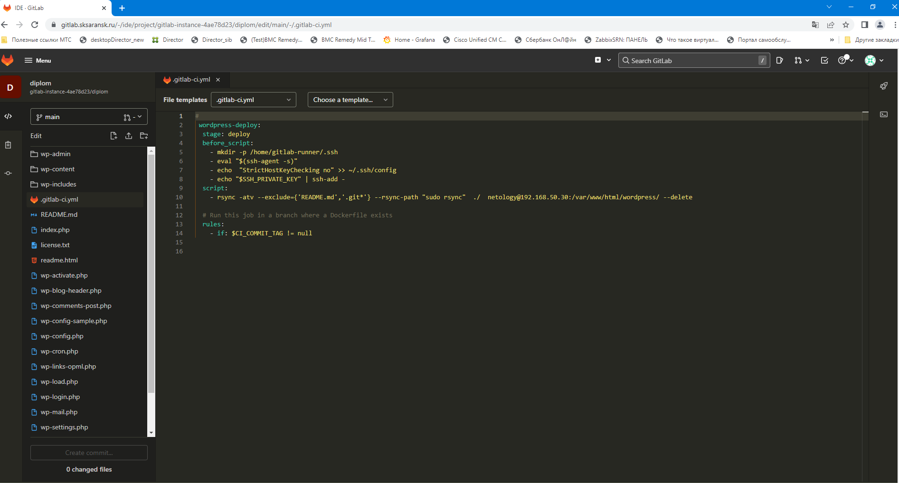
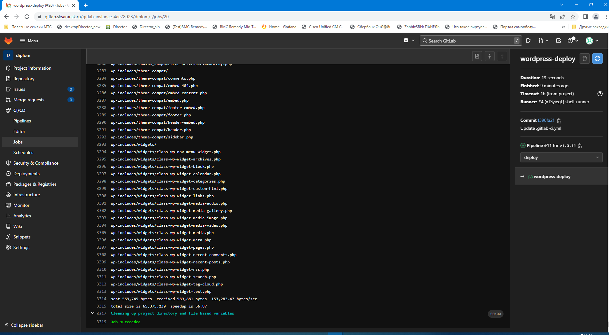
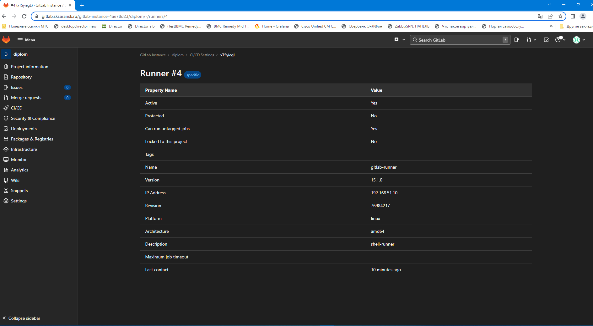
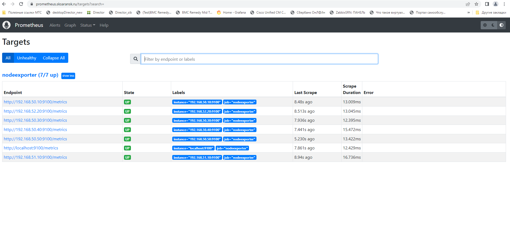
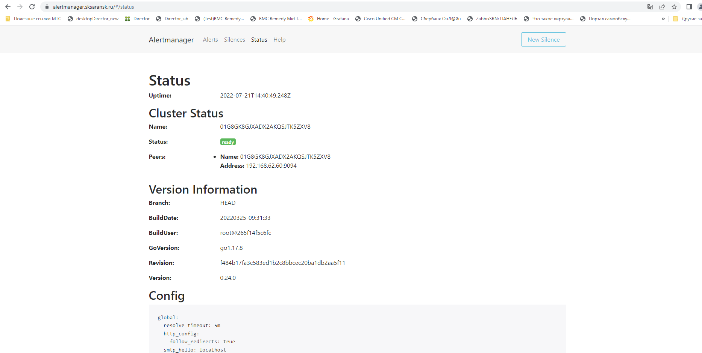
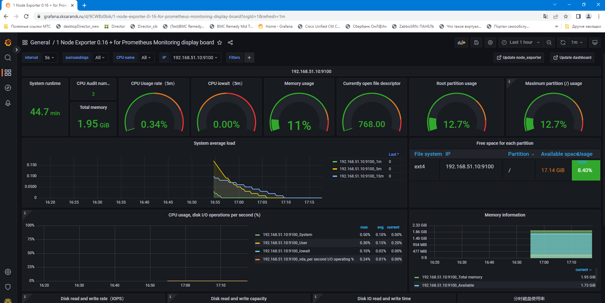

# Дипломное задание по курсу «DevOps-инженер»

## Дипломный практикум в YandexCloud

## Проведенные работы:

- Зарегистрировано доменное имя **sksaransk.ru** у регистратора **reg.ru**
 - Созданы  два workspace: stage и prod
 - Сконфигурирован S3 backend в YC облаке 
 

 - Токен для подключения к YC Cloud  экспортирован в переменную окружения YC_TOKEN
 - После последовательго применения команд terraform init, terraform plan, terraform apply в облаке инициализируется 7 хостов

- Подготовлены ansible роли, после разворачивания получили следующие сервисы:

  **Сайт на wordpress**
  
  
 
 
 **.gitlab-ci.yml**

 
 
 **gitlab job**
 
  
  
  
  **gitlab runner**
  
 

**prometheus**

**alertmanager**

**grafana**

- Учетная запись для входа в web-интерфейс у gitlab: root, wordpress: serg, у оставшихся: admin; пароль везде:
- Переменные задаются в variables.tf, S3 backend  настраивается в versions.tf
- По умолчанию сертификаты генерируются в тестовой зоне

